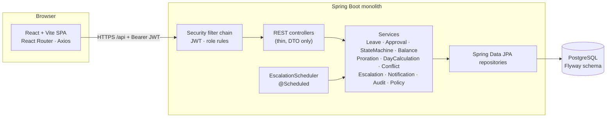
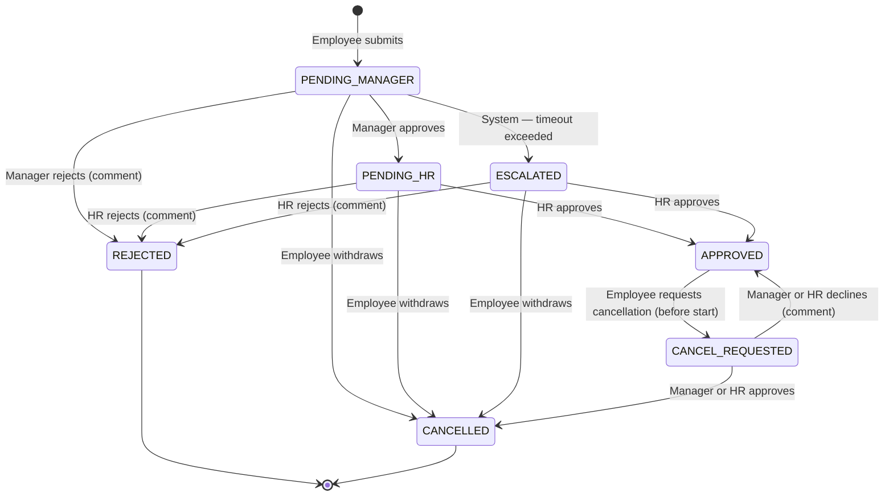

# LeaveFlow — Leave Management System

A leave management system with role-based access, a two-stage approval workflow (manager → HR), an explicit state machine, pro-rated balances, team conflict detection, automatic escalation, an audit trail, in-app notifications, a team calendar and analytics.

- **Backend:** monolithic Spring Boot 3 REST API (Java 17+, PostgreSQL, JWT)
- **Frontend:** React + Vite dashboard for employees, managers and HR

---

## Contents

1. [Project overview](#1-project-overview)
2. [Architecture](#2-architecture)
3. [Technology stack](#3-technology-stack)
4. [Project structure](#4-project-structure)
5. [Database setup](#5-database-setup)
6. [Backend setup](#6-backend-setup)
7. [Frontend setup](#7-frontend-setup)
8. [Environment variables](#8-environment-variables)
9. [API documentation](#9-api-documentation)
10. [User roles](#10-user-roles)
11. [Leave state machine](#11-leave-state-machine)
12. [Business rules](#12-business-rules)
13. [Leave-day calculation](#13-leave-day-calculation)
14. [Proration logic](#14-proration-logic)
15. [Conflict detection](#15-conflict-detection)
16. [Escalation mechanism](#16-escalation-mechanism)
17. [Demo credentials](#17-demo-credentials)
18. [How to run the project](#18-how-to-run-the-project)
19. [How to run tests](#19-how-to-run-tests)
20. [Demo workflow](#20-demo-workflow)
21. [Troubleshooting](#21-troubleshooting)

---

## 1. Project overview

| Capability | What it does |
|---|---|
| Role-based access | Separate EMPLOYEE, MANAGER and HR roles. The backend enforces them at the URL, method and record level. |
| Leave application | Validates dates, excludes weekends and holidays, checks the balance and overlaps, and gives a live preview before submitting. |
| Two-stage approval | Manager decides first, then HR. Every status change goes through `LeaveStateMachineService`. |
| Pro-rated balances | Entitlement comes from database policies and is pro-rated by joining date. |
| Team conflicts | Shows the team's absence % per day and warns above a configurable threshold. It **never auto-rejects**. |
| Automatic escalation | A scheduler moves requests left with a manager past the timeout to HR. |
| Audit trail | Every transition, balance movement and configuration change is recorded. |
| Notifications | In-app notifications, built behind a channel interface so email or push can be added later. |
| Team calendar | Month grid of who is away, with overlaps and over-threshold days highlighted. |
| Analytics | Status breakdown, utilisation, leave-type distribution, monthly trend and team absence. |

## 2. Architecture



- **Layering:** controllers only translate HTTP to service calls. Business rules live in small, focused services, and entities are never returned (every response is a DTO record).
- **One way to change status:** `LeaveTransitionService` runs each transition in a single transaction:
  1. validate and apply the status change through the state machine;
  2. move the balance;
  3. write the audit entries;
  4. send notifications.

  Employee cancellations, manager and HR decisions, and the scheduler all use it.
- **Concurrency:** `LeaveRequest` and `LeaveBalance` carry an `@Version`.
  - A double click or retry can't apply a transition twice: the second attempt fails with `409 INVALID_STATE_TRANSITION` or `409 CONCURRENT_MODIFICATION`.
  - Submissions lock the employee row, so the overlap and balance checks can't race.

## 3. Technology stack

| Layer | Technology |
|---|---|
| Backend | Java 17 (runs on 17–21), Spring Boot 3.3, Spring Web, Spring Data JPA, Spring Security, Bean Validation, Spring Scheduler |
| Auth | JWT (jjwt 0.12, HS256+), BCrypt password hashing |
| Database | PostgreSQL 16, Flyway migrations, Hibernate schema validation |
| Build | Maven (wrapper included: `./mvnw`) |
| Utilities | Lombok |
| Tests | JUnit 5, Mockito, AssertJ, Spring MockMvc, H2 (in-memory, tests only) |
| Frontend | React 19, Vite, React Router, Axios, hand-written responsive CSS (light and dark) |

## 4. Project structure

```text
.
├── docker-compose.yml             # PostgreSQL 16
├── .env.example                   # all configurable values
├── backend/
│   ├── pom.xml, mvnw
│   └── src/
│       ├── main/java/com/accentra/leavemanagement/
│       │   ├── config/            # AppProperties, Clock, settings initializer, demo seeder
│       │   ├── controller/        # Auth, Employee, Leave, Manager, Hr, Team, Notification,
│       │   │                      # Analytics, Policy, Settings, Holiday
│       │   ├── dto/               # request/response records
│       │   ├── entity/            # User, Employee, Team, LeaveRequest, LeaveType, LeaveBalance,
│       │   │                      # LeavePolicy, AuditLog (approval history), Holiday,
│       │   │                      # Notification, WorkflowSettings
│       │   ├── enums/             # Role, LeaveStatus, LeaveAction, ActorRole, AuditAction, NotificationType
│       │   ├── exception/         # typed API exceptions + GlobalExceptionHandler
│       │   ├── repository/
│       │   ├── security/          # JWT service/filter, SecurityConfig, JSON 401/403 handlers
│       │   ├── service/           # LeaveService, ApprovalService, LeaveBalanceService,
│       │   │                      # LeaveProrationService, LeaveDayCalculationService,
│       │   │                      # ConflictDetectionService, EscalationService, NotificationService,
│       │   │                      # PolicyService, AuditService, LeaveStateMachineService,
│       │   │                      # LeaveTransitionService, TeamService, AnalyticsService, …
│       │   └── scheduler/         # EscalationScheduler
│       ├── main/resources/
│       │   ├── application.yml
│       │   └── db/migration/V1__initial_schema.sql
│       └── test/                  # unit + integration tests, application-test.yml (H2)
└── frontend/
    ├── package.json, vite.config.js, index.html
    └── src/
        ├── api/                   # axios client (JWT, 401 handling) + endpoint functions
        ├── auth/                  # AuthContext, RequireAuth route guard
        ├── components/            # Layout, badges, tables, modals, conflict panel, charts, …
        ├── pages/                 # Login, LeaveDetail (approval screen), TeamCalendar, Notifications
        │   ├── employee/          # Dashboard, ApplyLeave, MyLeaves
        │   ├── manager/           # Dashboard, Approvals
        │   └── hr/                # Dashboard, Approvals, Escalations, AllLeaves, Policies,
        │                          # Holidays, Analytics, AuditLog
        └── styles.css
```

## 5. Database setup

The easiest way is Docker:

```bash
cp .env.example .env              # optional: adjust credentials/ports
docker compose up -d              # starts PostgreSQL 16 on localhost:5432
```

This creates the database `leave_management` with user `leave_user` / password `leave_password`.

**Using your own PostgreSQL instead:**

```sql
CREATE DATABASE leave_management;
CREATE USER leave_user WITH PASSWORD 'leave_password';
GRANT ALL PRIVILEGES ON DATABASE leave_management TO leave_user;
ALTER DATABASE leave_management OWNER TO leave_user;
```

You don't need to create tables yourself:
- Flyway creates the schema (`V1__initial_schema.sql`) on first start: primary and foreign keys, unique and check constraints, and indexes.
- Hibernate then validates the entity mappings against that schema (`ddl-auto: validate`).

## 6. Backend setup

Requires JDK 17 or newer. Maven isn't needed; the wrapper downloads it.

```bash
cd backend
./mvnw spring-boot:run            # http://localhost:8080
```

On first start, the app:
1. applies the Flyway migration;
2. creates the workflow settings row (from the environment defaults);
3. seeds demo data if `APP_SEED_ENABLED=true` (the default) and the database is empty.

Health check: `GET http://localhost:8080/actuator/health`.

## 7. Frontend setup

Requires Node.js 20.19+.

```bash
cd frontend
npm install
npm run dev                       # http://localhost:5173
```

In development, Vite proxies `/api` to `http://localhost:8080` (`VITE_API_PROXY_TARGET`), so there are no CORS issues. For a production build, run `npm run build` and serve `frontend/dist`. Either put it behind the same origin as the API, or set `VITE_API_BASE_URL` and `APP_CORS_ALLOWED_ORIGINS`.

## 8. Environment variables

### Backend

| Variable | Default | Purpose |
|---|---|---|
| `DB_HOST` / `DB_PORT` / `DB_NAME` | `localhost` / `5432` / `leave_management` | PostgreSQL location |
| `DB_USERNAME` / `DB_PASSWORD` | `leave_user` / `leave_password` | PostgreSQL credentials |
| `SERVER_PORT` | `8080` | API port |
| `APP_JWT_SECRET` | dev-only value | Base64 secret of at least 256 bits. **Set this outside local development** (`openssl rand -base64 48`). |
| `APP_JWT_EXPIRATION_MINUTES` | `480` | Token lifetime |
| `APP_CORS_ALLOWED_ORIGINS` | `http://localhost:5173` | Comma-separated allowed origins |
| `APP_TIMEZONE` | JVM default | Business time zone used for "today" |
| `APP_ESCALATION_TIMEOUT_MINUTES` | `1440` | Initial manager-approval timeout. Seeded once; HR edits it in the UI afterwards. |
| `APP_TEAM_ABSENCE_THRESHOLD_PERCENT` | `30` | Initial team absence threshold. Seeded once; HR edits it in the UI afterwards. |
| `APP_ESCALATION_CHECK_INTERVAL_MS` | `60000` | How often the scheduler runs |
| `APP_ESCALATION_INITIAL_DELAY_MS` | `15000` | Delay before the first scheduler run |
| `APP_SEED_ENABLED` | `true` | Seed demo data into an empty database. **Set `false` in production.** |
| `APP_DEMO_PASSWORD` | `Demo@1234` | Password given to seeded demo accounts |

### Frontend (`frontend/.env`)

| Variable | Default | Purpose |
|---|---|---|
| `VITE_API_PROXY_TARGET` | `http://localhost:8080` | Dev-server proxy target |
| `VITE_API_BASE_URL` | `/api` | API base URL used by the built app |
| `VITE_SHOW_DEMO_ACCOUNTS` | shown | Set `false` to hide the demo-account shortcuts on the login page |

## 9. API documentation

All endpoints except login require `Authorization: Bearer <token>`. Errors share one JSON shape:

```json
{ "timestamp": "…", "status": 409, "error": "Conflict", "code": "INVALID_STATE_TRANSITION",
  "message": "Cannot hr approve a request that is pending manager", "path": "/api/hr/leaves/12/approve",
  "fieldErrors": [ { "field": "reason", "message": "Reason is required" } ] }
```

| Status | Codes |
|---|---|
| 400 | `VALIDATION_FAILED`, `INVALID_DATE_RANGE`, `MALFORMED_REQUEST` |
| 401 | `UNAUTHORIZED`, `INVALID_CREDENTIALS` |
| 403 | `FORBIDDEN` |
| 404 | `NOT_FOUND` |
| 409 | `INVALID_STATE_TRANSITION`, `OVERLAPPING_LEAVE`, `DUPLICATE_RESOURCE`, `CONCURRENT_MODIFICATION` |
| 422 | `INSUFFICIENT_BALANCE`, `COMMENT_REQUIRED`, `CANCELLATION_NOT_ALLOWED`, `NO_MANAGER`, `LEAVE_TYPE_INACTIVE` |

### Auth

| Method | Path | Roles | Description |
|---|---|---|---|
| POST | `/api/auth/login` | public | `{email, password}` → `{token, tokenType, expiresAt, user}` |

### Employee and leave

| Method | Path | Roles | Description |
|---|---|---|---|
| GET | `/api/employees/me` | any | Own profile (team, manager, joining date) |
| GET | `/api/employees/me/balance?year=` | any | Balances per leave type (annual, allocated, used, pending, remaining) |
| POST | `/api/leaves/preview` | EMPLOYEE | Dry run: days charged, holidays, balance after, overlap, team impact (aggregated only) |
| POST | `/api/leaves` | EMPLOYEE | Apply: `{leaveTypeId, startDate, endDate, reason}` → `201` with request, balance, conflicts, history |
| GET | `/api/leaves/my` | EMPLOYEE | Own requests |
| GET | `/api/leaves/{id}` | owner / assigned manager / HR | Details, balance, approval history, and live team conflicts (manager and HR only) |
| POST | `/api/leaves/{id}/cancel` | EMPLOYEE (owner) | Withdraws a pending request, or asks to cancel upcoming approved leave. Body `{comment}` optional. |

Each request response includes `availableActions`: the transitions the current viewer may perform. The UI draws buttons from this list and the backend re-validates every action.

### Manager

| Method | Path | Description |
|---|---|---|
| GET | `/api/manager/leaves/pending` | Direct reports' requests awaiting the manager, plus cancellation requests |
| GET | `/api/manager/leaves/escalated` | Own requests that were escalated to HR |
| GET | `/api/manager/leaves/history` | Requests the manager has already processed |
| POST | `/api/manager/leaves/{id}/approve` | `PENDING_MANAGER → PENDING_HR` |
| POST | `/api/manager/leaves/{id}/reject` | `PENDING_MANAGER → REJECTED` (`comment` required) |
| POST | `/api/manager/leaves/{id}/cancellation/approve` | `CANCEL_REQUESTED → CANCELLED` (restores the balance) |
| POST | `/api/manager/leaves/{id}/cancellation/reject` | `CANCEL_REQUESTED → APPROVED` (`comment` required) |

### HR

| Method | Path | Description |
|---|---|---|
| GET | `/api/hr/leaves/pending` | `PENDING_HR` requests and cancellation requests |
| GET | `/api/hr/leaves/escalated` | `ESCALATED` requests |
| GET | `/api/hr/leaves?status=&teamId=` | All leave across the organisation |
| POST | `/api/hr/leaves/{id}/approve` | `PENDING_HR` or `ESCALATED → APPROVED` (moves days from pending to used) |
| POST | `/api/hr/leaves/{id}/reject` | `PENDING_HR` or `ESCALATED → REJECTED` (`comment` required) |
| POST | `/api/hr/leaves/{id}/cancellation/approve` / `…/reject` | Same as the manager endpoints |
| GET | `/api/hr/audit?action=&page=&size=` | Paged audit history |

### Teams, notifications, analytics, configuration

| Method | Path | Roles | Description |
|---|---|---|---|
| GET | `/api/teams` | MANAGER (own teams), HR (all) | Team list with member counts |
| GET | `/api/teams/{id}/calendar?from=&to=` | team's manager, HR | Members, leaves and per-day availability (max 93 days) |
| GET | `/api/teams/{id}/conflicts?from=&to=` | team's manager, HR | Working days with 2+ people away or absence above the threshold |
| GET | `/api/notifications` | any | Latest 50 notifications with unread count |
| GET | `/api/notifications/unread-count` | any | Badge count |
| POST | `/api/notifications/{id}/read`, `/api/notifications/read-all` | any | Mark as read |
| GET | `/api/analytics?year=` | HR | Totals, status breakdown, utilisation, type distribution, monthly trend, team absence |
| GET | `/api/policies` | any | Leave types and their policies |
| POST | `/api/policies` | HR | Create a leave type and its policy |
| PUT | `/api/policies/{id}` | HR | Update entitlement or rules; re-allocates this year's balances |
| GET / PUT | `/api/settings` | HR | Escalation timeout (minutes) and team absence threshold (%) |
| GET | `/api/holidays?year=` | any | Holiday calendar |
| POST | `/api/holidays` | HR | Add a holiday (unique per date) |
| DELETE | `/api/holidays/{id}` | HR | Remove a holiday |

## 10. User roles

| Role | Can | Cannot |
|---|---|---|
| **EMPLOYEE** | Apply for leave; view own requests, balances and history; withdraw pending requests; ask to cancel upcoming approved leave; read notifications | Approve anything; see other employees' requests; open manager or HR screens or APIs |
| **MANAGER** | See and decide their direct reports' manager-stage requests and cancellations; view their team calendar, conflicts and warnings; view escalations and history | Perform HR-stage approval; see other managers' teams; decide escalated requests |
| **HR** | Final approval and rejection; decide escalated requests; view all leave, analytics and audit history; configure leave types, entitlements, threshold, timeout and holidays | Skip the manager stage (a `PENDING_MANAGER` request can't be HR-approved) |

Authorization is enforced three times:
1. URL rules in `SecurityConfig`;
2. `@PreAuthorize` on controllers;
3. record-level checks in services (`LeaveAccessPolicy`, and the state machine's actor guards, e.g. "only the assigned manager").

Hiding a button in the frontend is for convenience only; it is not what protects the data.

## 11. Leave state machine



`LeaveStateMachineService` holds this table and is the only code that sets `LeaveRequest.status`. For every transition it checks, in order:

1. **Actor role:** otherwise `403`.
2. **Current state:** otherwise `409`.
3. **Actor guards:**
   - an employee acts only on their own leave;
   - a manager acts only on requests assigned to them;
   - nobody decides their own leave.
4. **Business rules:**
   - cancellation is only allowed before the leave starts;
   - rejections need a comment.

## 12. Business rules

- **Applying:**
  - The start date must be today or later, and the end date on or after the start date.
  - Start and end must be in the same calendar year, the range can be at most 90 calendar days, and leave can be booked at most 12 months ahead.
- **Chargeable days:** a request must contain at least one chargeable day.
- **Overlaps:** a request can't overlap the employee's own active request (pending, escalated, approved or cancel-requested) → `409 OVERLAPPING_LEAVE`.
- **Balance:** requested days must not exceed the remaining balance, where remaining = allocated − used − pending → `422 INSUFFICIENT_BALANCE`.
- **Balance movements**, all in the same transaction as the status change:

  | Event | pending | used |
  |---|---|---|
  | Submit | +days | |
  | HR approve | −days | +days |
  | Reject / withdraw | −days | |
  | Cancellation approved | | −days |

  Each movement is also written to the audit trail as a `System` `BALANCE_UPDATED` entry.
- **Team conflicts** never block or reject a request. They are recorded on the request (`teamAbsencePercent`, `teamLeaveWarning`, `hasTeamConflict`) and shown to the manager.
- **Policies are database-driven.** Changing an entitlement re-allocates the current year's balances. Inactive leave types can't be requested.
- **Holidays:** at most one per date. Changes affect requests submitted afterwards; requests already submitted keep the day count they were created with.

## 13. Leave-day calculation

`LeaveDayCalculationService` is the only place dates are turned into leave days. For each date in the inclusive range:

| Day | Default | Policy override |
|---|---|---|
| Saturday / Sunday | not charged | `countWeekends = true` |
| Public holiday (weekday) | not charged | `countHolidays = true` |
| Other weekday | charged | — |

A holiday that falls on a weekend counts as a weekend day, so it is never double-counted. The same service provides the working days used for team availability.

## 14. Proration logic

`LeaveProrationService` uses a **monthly accrual with a mid-month cut-off**:

- Joined **before** the year → full entitlement.
- Joined **after** the year → 0.
- Joined **during** the year:
  - If the joining day is on or before the 15th, the joining month counts.
  - If it is after the 15th, accrual starts the following month.
  - `entitlement = annual × eligibleMonths / 12`, rounded half-up to the nearest **0.5 day**.

| Annual | Joined | Eligible months | Entitlement |
|---|---|---|---|
| 24 | 1 Jul | 6 | **12** |
| 24 | 15 Jan | 12 | 24 |
| 24 | 16 Jan | 11 | 22 |
| 24 | 20 Jul | 5 | 10 |
| 10 | 1 Jun | 7 | 5.83 → **6.0** |

Balances are created lazily per employee, leave type and year from the current policy. A policy with `prorated = false` grants the full amount.

## 15. Conflict detection

`ConflictDetectionService` evaluates each **working day** of a request:

```text
absence% (day) = (team members on active leave that day + the applicant) / team size × 100
```

- "Active leave" means pending manager, pending HR, escalated, approved and cancel-requested.
- The result reports:
  - team size;
  - the peak number of people unavailable, the peak % and the peak date;
  - the affected dates, each with who is away;
  - the overlapping requests;
  - a message, e.g. *"High team absence: 42.9% of the team (3 of 7) is unavailable on 13 Oct 2026. Threshold is 30%."*
- `teamLeaveWarning = true` when any day's absence % is **strictly greater** than the configured threshold (HR setting, default 30%).
- **Managers and HR** see colleagues' names.
- **Employees** see only aggregated numbers in the apply-form preview, so colleagues' leave stays private.
- The same per-day calculation powers the team calendar, the `/conflicts` endpoint and the team statistics in analytics.

## 16. Escalation mechanism

`EscalationScheduler` calls `EscalationService` every `APP_ESCALATION_CHECK_INTERVAL_MS` (default 60 s). Each run:

1. Reads the timeout from `workflow_settings` (HR-editable; default 1440 min = 24 h).
2. Finds `PENDING_MANAGER` requests created before `now − timeout`.
3. For each one, in its **own transaction**, re-loads the request and re-checks that it is still pending and overdue.
4. Moves it to `ESCALATED` as the `System` actor.
5. Sets `escalatedAt`, writes an `ESCALATED` audit entry, and notifies all HR users (plus the manager and the employee).

It is safe to run repeatedly:
- Already-escalated or decided requests are skipped.
- `@Version` optimistic locking handles a manager acting at the same moment.
- A partial unique index (`uk_audit_logs_single_escalation`) makes a second escalation record for the same request impossible.
- A failure on one request doesn't stop the others.

HR then decides `ESCALATED` requests directly (→ `APPROVED` / `REJECTED`). To demo quickly, set **HR → Policies & settings → Manager approval timeout** to `1` minute.

## 17. Demo credentials

These are seeded only when `APP_SEED_ENABLED=true` and the database is empty. **They are for local demos only.** Every account uses the password **`Demo@1234`** (configurable with `APP_DEMO_PASSWORD`).

| Role | Email | Name | Notes |
|---|---|---|---|
| HR | `hr@demo.com` | Hannah Reed | |
| Manager | `manager@demo.com` | Marcus Chen | Engineering (7 people) |
| Manager | `manager2@demo.com` | Sofia Alvarez | Design (4 people) |
| Employee | `employee1@demo.com` | Aarav Patel | Engineering; has past approved and rejected leave |
| Employee | `employee2@demo.com` | Priya Nair | Engineering; **mid-year joiner (1 July)** → pro-rated balances |
| Employee | `employee3@demo.com` | Rahul Verma | Engineering; approved leave in the conflict window |
| Employee | `employee4@demo.com` … `employee7@demo.com` | Emily, Daniel, Meera, Lucas | Engineering |
| Employee | `employee8@demo.com` … `employee11@demo.com` | Ananya, Oliver, Zara, Noah | Design |

The seeded data covers both teams, manager relationships, three leave types (Casual 12, Sick 10 and Earned 24 days per year), holidays for this year and next, and balances. It also includes leave requests in every status and notifications.

**Planted conflict:** Engineering already has two people away Tuesday–Wednesday of the week after next, so a third request on those days goes over the 30% threshold.

**Planted escalation:** one Design request was submitted 30 hours ago, so the scheduler escalates it shortly after the first start.

## 18. How to run the project

```bash
git clone git@github.com:Aksh6472/Accentra-codeathon.git && cd Accentra-codeathon
docker compose up -d                          # 1. database
(cd backend && ./mvnw spring-boot:run)        # 2. API on :8080   (separate terminal)
(cd frontend && npm install && npm run dev)   # 3. UI on :5173    (separate terminal)
```

Then open http://localhost:5173 and sign in with a demo account.

To reset the demo data completely, run `docker compose down -v`, then start again.

## 19. How to run tests

```bash
cd backend
./mvnw test
```

The tests use an in-memory H2 database, so they don't need PostgreSQL or Docker. There are 84 tests:

| Suite | Covers |
|---|---|
| `LeaveProrationServiceTest` | Full-year employee, mid-year joiners (1 Jul → 12 of 24), cut-off day, rounding, joining after the year, non-pro-rated policy |
| `LeaveBalanceServiceTest` | Full-year and mid-year allocation from policy, zero remaining balance, pending → used → restored movements, negative-balance guard |
| `LeaveDayCalculationServiceTest` | Weekdays, weekends, public holidays, weekend + holiday combination, policy overrides |
| `ConflictDetectionServiceTest` | No conflict, partial overlap, multiple overlapping employees, excessive absence (4 of 10 = 40% > 30%), exactly-at-threshold, privacy view |
| `LeaveStateMachineServiceTest` | Manager approval, HR approval, manager and HR rejection, escalated → HR, invalid transitions, wrong actor, cancellation rules, available actions |
| `EscalationServiceTest` | Within timeout, beyond timeout, already escalated is not escalated again, decided meanwhile, concurrent modification |
| `SecurityIntegrationTest` | 401 without or with an invalid token, access per role for employee, manager and HR, 403 across roles and teams, record-level privacy, validation errors |
| `LeaveWorkflowIntegrationTest` | Employee → Manager → HR → Approved with balance, history and notifications; retry doesn't double-deduct; rejection; conflict warning without auto-reject; timeout → escalated exactly once → HR; mid-year proration; overlap, insufficient balance and past dates |

Frontend build check: `cd frontend && npm run build`.

## 20. Demo workflow

### Scenario 1: normal approval, with a mid-year joiner and a conflict warning

1. Sign in as **`employee2@demo.com`** (Priya, joined 1 July). The dashboard shows **Pro-rated** balances, e.g. Earned 12 of 24.
2. Sign in as **`employee1@demo.com`** → **Apply for leave**.
   - Pick *Casual Leave* and Tuesday–Thursday of the week after next.
   - The summary shows the days charged, weekend and holiday exclusions, and the remaining balance before and after.
   - A **High team absence (42.9% > 30%)** warning appears. Submit anyway: the request becomes `PENDING_MANAGER`.
3. Sign in as **`manager@demo.com`** → **Approvals** → open the request. You'll see:
   - the employee, dates, days, reason and remaining balance;
   - team absence %, affected days, overlapping colleagues and approval history.
4. Click **Approve** and confirm. The status becomes `PENDING_HR`.
5. Sign in as **`hr@demo.com`** → **HR approvals** → open the request → **Approve**. The status becomes `APPROVED`, and the balance moves from pending to used.
6. Back as the employee:
   - **Notifications** show *Manager approved* and *Leave approved*;
   - the request's **Approval history** shows Submitted → Balance updated → Manager approved → HR approved → Balance updated.

### Scenario 2: automatic escalation

1. As **HR** → **Policies & settings**, set *Manager approval timeout* to **1** minute and save.
2. As an **employee**, apply for leave, and don't approve it as the manager.
3. Within about 1–2 minutes, the scheduler moves it to `ESCALATED`:
   - it appears in **HR → Escalations**;
   - HR gets a *Leave request escalated* notification;
   - the history shows a `System` *Escalated to HR* entry.
4. HR approves or rejects it directly. Afterwards, set the timeout back to 1440.

The seeded Design request (Oliver Brown, submitted 30 hours ago) is already escalated within a minute of the first start, with no action needed.

### Also worth showing

- **Team calendar** (manager or HR): the month grid, striped pending leave, weekend and holiday shading, the absence % row, and over-threshold days highlighted.
- **Cancellation:** an employee opens an upcoming approved request → *Request cancellation*. The manager approves it and the days return to the balance.
- **Analytics**, **Audit history**, and **Holidays** (add a holiday, then preview leave over it).
- **Security:** open `/hr/analytics` as an employee (redirected), or call a manager endpoint with an employee token (`403`).

## 21. Troubleshooting

| Symptom | Fix |
|---|---|
| `Connection refused` to PostgreSQL on startup | Run `docker compose up -d` and wait until `docker compose ps` shows the container healthy. Check `DB_*` variables and that port 5432 isn't used by another Postgres. |
| `Schema-validation` or Flyway checksum error | The database was created by a different schema version. For a demo, reset with `docker compose down -v && docker compose up -d`. |
| `app.jwt.secret must be … at least 256 bits` | `APP_JWT_SECRET` must be Base64 and at least 32 bytes: `openssl rand -base64 48`. |
| Login works but every call returns 401 | The token expired or the secret changed after a restart. Sign in again. |
| UI shows "Cannot reach the server" | Start the backend on :8080, or set `VITE_API_PROXY_TARGET`. |
| CORS errors from a custom frontend origin | Add it to `APP_CORS_ALLOWED_ORIGINS`. |
| No demo users | Seeding only runs on an empty database with `APP_SEED_ENABLED=true`. Reset the database volume. |
| Escalation doesn't happen | Lower the timeout in HR → Policies & settings. The scheduler runs every `APP_ESCALATION_CHECK_INTERVAL_MS`. Only `PENDING_MANAGER` requests escalate. |
| `./mvnw: Permission denied` | `chmod +x backend/mvnw` |
| Port 5432, 8080 or 5173 already in use | Change `DB_PORT`, `SERVER_PORT` or the Vite port, and update the proxy target to match. |
